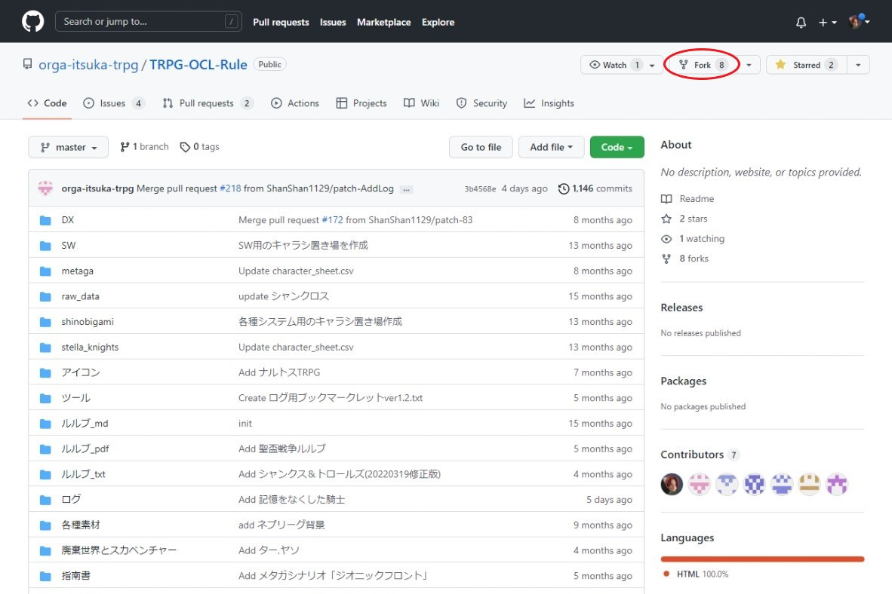

# test
テスト用
### 画像やpdfファイルの追加
画像やpdfファイルなどは権限の都合上、ちょっと手順が異なることを教える  
また一度プルリクをやってくれたシャンカーの場合、追加で最初にやることが1つあるので、  
この章をさっくり読みつつ[こちらも読んでおいてくれ(^^)](#2回目以降のプルリク協力シャン向け)  

#### ①リポジトリのフォーク
まずは追加にあたってリポジトリのフォークという手順を行う必要がある  
このリポジトリをコピーするような物だ、気軽にやるぞ　来い  
ページの右上にあるforkを押してくれ(^^)  
||
| ----- |

そうすると下のようにforkする際の名前の設定などのページが出てくる  
ここは特に何も変更せずにCreate forkでいいよ～  
||
| ----- |
注：アカウントの都合上、ここでは別のリポジトリ(BCDice)のfork画面を使っていることを教える
　　実際はRepository nameやらDescriptionやらが違うけど気にしないでくれ(^^)

下のような画面になれば成功だな　ルフィ  
赤で囲まれたShanShan1129となっている部分は、自分で決めたユーザ名になっているはずだ
||
| ----- |

#### ②ブランチ作成
次はブランチというものを作る  
ブランチ切替のボタン①を押して、下の`Find or ...`②のところにpatch-1と半角で入力してくれ  
そうしたらcreate branch...③ という表示が出るのでそれをクリックする　来い 
||
| ----- |
注：この時create branchが出なかった場合、もうそのブランチは作成済みだ　番号を2、3とずらしていくことを…勧める…

上にBranch created. と表示されてたらブランチ作成完了だァ～～～！！！  
ということで、ここからファイルの追加を行っていくことを教える

#### ③各種ファイルのアップロードとコミット
ここから念願のファイルの追加作業が始まることを教える  
今回はアイコン画像の追加をするぞ　来い　pdfファイル等も同じ手順でできるので、フォルダを適宜合わせてくれ(^^)  
ということでアイコンフォルダを開いて…  
実はこの画面、ファイルをドラッグアンドドロップ(以下D&D)することができるぞォ！  
複数まとめてでも大丈夫　githubのインターフェースは格が違う  
||
| ----- |

そして今回アップロードする画像をD&Dすると下のような画面になる  
今回は例としてヨガシャン.jpgをアップロードした  
こんな感じに追加したいファイルがアップロードされたことを確認してくれ(^^)  
||
| ----- |
注：失敗する場合ファイル名に問題があることが多い　全角スペースとかは御法度だなァ…

確認ができたらCommit changesを押すぞォ！  
||
| ----- |

処理が終わるとブランチのトップに戻されて、
差分ができたからプルリクしてくれ(^^)ってメッセージが新たに表示されることを教える  
なので早速プルリクだァ～～～！！！  
||
| ----- |

ここから先は上の方にあったプルリクのタイトルやコメントの記載と同じなので省略・皇  

### 2回目以降のプルリク協力シャン向け

2回目以降やらないといけないこと

ここでは2回目以降プルリクを行った場合に確認しなければならない"masterブランチの同期"をお前に教える  
#### masterブランチの同期
まずは自分のforkしたリポジトリに移動するぞ　来い  
ページの右上にあるforkを押してくれ(^^)  
||
| ----- |

そうした場合このような画面になるはずだ  
要は一度つくったからそれ以上はいらねェよなァ？って画面だな  
気にすることなく赤枠のリンクを押してくれ(^^)  
||
| ----- |

そうすればforkした自分のリポジトリを開けるぞォ！  
そしてこの画面でブランチの同期を確認するぞ　来い  
Fetch upstream①を押した後、Fetch and merge②のボタンが薄かったら最新の状態に保たれている、濃かったら同期が必要のサインだ　押してくれ(^^)  
||
| ----- |

押した場合は上に`Successfully fetched...`と表示されれば宴だァ～～～！！！  

こんな感じに最新のバージョンになっていることを確認できたら、この後は[②ブランチ作成](#ブランチ作成)に従ってファイルを追加、プルリクしてくれ(^^)  

